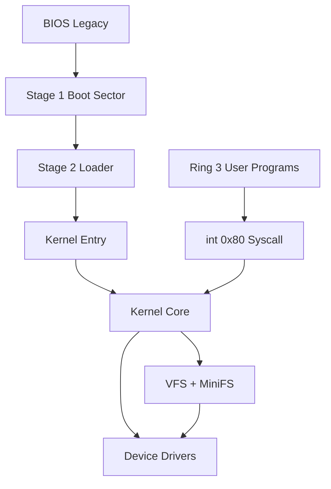

# 总体架构设计

> 状态：前置设计。后续实现必须让代码与本文件保持一致；若实现调整，先更新本文档。

## 架构目标

MiniOrangeOS 是 x86 32 位 BIOS 启动的教学操作系统。最低完成状态必须证明：

- 自写 Stage 1 和 Stage 2 完成启动；
- Loader 读取 E820 并加载 ELF32 内核；
- 内核运行于高半地址；
- 内核支持分页、Ring 3、抢占式调度、系统调用；
- 用户程序以静态 ELF32 形式从自定义持久化文件系统加载；
- 用户非法访问只影响当前进程；
- QEMU、宿主测试、CI 和文档闭环通过。

## 分层模型



## 目录职责

后续仓库应采用以下目录。除非计划书更新，不得随意改变顶层结构。

```text
MiniOrangeOS/
├── boot/
│   ├── stage1/
│   ├── stage2/
│   └── include/
├── kernel/
│   ├── arch/x86/
│   ├── core/
│   ├── mm/
│   ├── proc/
│   ├── syscall/
│   ├── fs/
│   ├── drivers/
│   └── include/
├── user/
│   ├── crt/
│   ├── libc/
│   └── programs/
├── tools/
├── tests/
├── environment/
├── docs/
└── Makefile
```

职责边界：

| 目录 | 职责 | 不应包含 |
|---|---|---|
| `boot/` | Stage 1、Stage 2、启动期 BIOS/磁盘/ELF 加载 | 内核调度、VFS、用户程序 |
| `kernel/arch/x86/` | GDT、IDT、TSS、中断入口、分页硬件相关代码 | 与 x86 无关的数据结构策略 |
| `kernel/core/` | 日志、panic、初始化编排、通用链表和位图 | 设备细节 |
| `kernel/mm/` | PMM、VMM、堆、usercopy | 文件系统策略 |
| `kernel/proc/` | PCB、调度、等待队列、生命周期 | 磁盘格式 |
| `kernel/syscall/` | 系统调用入口、分发表、参数转换 | 直接访问设备寄存器 |
| `kernel/fs/` | VFS、MiniFS、路径、文件对象 | ATA 端口操作 |
| `kernel/drivers/` | 串口、VGA、键盘、PIT、PIC、ATA | 用户程序逻辑 |
| `user/` | crt0、最小 libc、用户命令 | 内核头的私有结构 |
| `tools/` | mkfs、fsck、镜像装配、测试辅助 | 内核运行时代码 |
| `tests/` | 宿主测试、QEMU 测试、损坏镜像样本 | 构建产物 |

## 初始化顺序

内核入口完成最小栈和 `.bss` 后，初始化顺序必须稳定：

1. 校验 Boot Info。
2. 初始化串口，确保后续 panic 可见。
3. 初始化 VGA 文本输出。
4. 初始化 GDT/TSS 基础描述符。
5. 初始化 IDT 和 CPU 异常处理。
6. 根据 E820 初始化物理页分配器。
7. 建立正式高半分页。
8. 初始化内核堆。
9. 初始化 PIC、PIT、键盘。
10. 初始化 ATA 和块设备。
11. 挂载 MiniFS。
12. 初始化进程表和调度器。
13. 从文件系统加载 `/bin/init`。
14. 开启中断，进入调度循环。

## 跨模块错误模型

内核内部错误返回统一使用负数错误码。建议最低集合：

| 错误 | 含义 |
|---|---|
| `-EINVAL` | 参数无效、格式错误、范围非法 |
| `-ENOENT` | 路径或对象不存在 |
| `-EEXIST` | 创建目标已存在 |
| `-ENOMEM` | 内存或页分配失败 |
| `-ENOSPC` | 磁盘块或 inode 耗尽 |
| `-EIO` | 设备读写失败 |
| `-EFAULT` | 用户指针非法 |
| `-EBADF` | 文件描述符非法 |
| `-ENOTDIR` | 路径中间组件不是目录 |
| `-EISDIR` | 对目录执行文件操作 |
| `-ENOTEMPTY` | 删除非空目录 |

Kernel panic 只用于不可恢复的内核不变量破坏，例如页表自相矛盾、内核栈损坏、启动期核心结构缺失。用户输入、损坏文件系统、用户程序异常不得触发 panic。

## 日志策略

串口是测试和调试的权威输出，VGA 是交互显示。日志级别：

```text
[BOOT]
[KERN]
[MM]
[PROC]
[SYS]
[FS]
[DRV]
[TEST]
[PANIC]
```

自动化测试只依赖串口日志，不依赖 VGA 截图。

