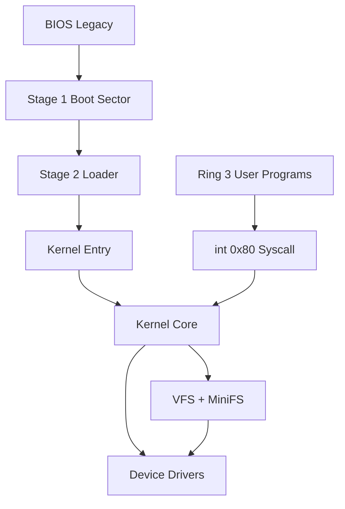

# 总体架构设计

> 状态：前置设计。后续实现必须让代码与本文件保持一致；若实现调整，先更新本文档。

## 架构目标

MiniOrangeOS 是 x86 32 位 BIOS 启动的教学操作系统。最低完成状态必须证明：

- 自写 Stage 1 和 Stage 2 完成启动；
- Loader 读取 E820 并加载 ELF32 内核；
- 内核运行于高半地址；
- 内核支持分页、Ring 3、抢占式调度、系统调用；
- 用户程序以静态 ELF32 形式从自定义持久化文件系统加载；
- 用户非法访问只影响当前进程；
- QEMU、宿主测试、CI 和文档闭环通过。

## 分层模型



## 目录职责

后续仓库应采用以下目录。除非计划书更新，不得随意改变顶层结构。

```text
MiniOrangeOS/
├── boot/
│   ├── stage1/
│   ├── stage2/
│   └── include/
├── kernel/
│   ├── arch/x86/
│   ├── core/
│   ├── mm/
│   ├── proc/
│   ├── syscall/
│   ├── fs/
│   ├── drivers/
│   └── include/
├── user/
│   ├── crt/
│   ├── libc/
│   └── programs/
├── tools/
├── tests/
├── environment/
├── docs/
└── Makefile
```

职责边界：

| 目录 | 职责 | 不应包含 |
|---|---|---|
| `boot/` | Stage 1、Stage 2、启动期 BIOS/磁盘/ELF 加载 | 内核调度、VFS、用户程序 |
| `kernel/arch/x86/` | GDT、IDT、TSS、中断入口、分页硬件相关代码 | 与 x86 无关的数据结构策略 |
| `kernel/core/` | 日志、panic、初始化编排、通用链表和位图 | 设备细节 |
| `kernel/mm/` | PMM、VMM、堆、usercopy | 文件系统策略 |
| `kernel/proc/` | PCB、调度、等待队列、生命周期 | 磁盘格式 |
| `kernel/syscall/` | 系统调用入口、分发表、参数转换 | 直接访问设备寄存器 |
| `kernel/fs/` | VFS、MiniFS、路径、文件对象 | ATA 端口操作 |
| `kernel/drivers/` | 串口、VGA、键盘、PIT、PIC、ATA | 用户程序逻辑 |
| `user/` | crt0、最小 libc、用户命令 | 内核头的私有结构 |
| `tools/` | mkfs、fsck、镜像装配、测试辅助 | 内核运行时代码 |
| `tests/` | 宿主测试、QEMU 测试、损坏镜像样本 | 构建产物 |

## 初始化顺序

分页前物理入口先校验 Boot Info，建立覆盖低端 0-4 MiB 的恒等映射及其 `0xC0000000` 高半别名，然后开启分页并跳转到高半入口。高半入口清零 `.bss` 并切换到独立启动栈；页目录、页表和启动栈位于独立 NOBITS 启动区，不属于 `.bss`。

进入 C 初始化后的顺序必须稳定：

1. 初始化正式串口驱动，确保后续 panic 可见。
2. 初始化 VGA 文本输出。
3. 初始化 GDT/TSS 基础描述符。
4. 初始化 IDT 和 CPU 异常处理。
5. 根据 E820 初始化物理页分配器。
6. 建立正式高半分页。
7. 初始化内核堆。
8. 初始化 PIC、PIT、键盘。
9. 初始化 ATA 和块设备。
10. 挂载 MiniFS。
11. 初始化进程表和调度器。
12. 从文件系统加载 `/bin/init`。
13. 开启中断，进入调度循环。

## 跨模块错误模型

内核内部错误返回统一使用负数错误码。建议最低集合：

| 错误 | 含义 |
|---|---|
| `-EINVAL` | 参数无效、格式错误、范围非法 |
| `-ENOENT` | 路径或对象不存在 |
| `-EEXIST` | 创建目标已存在 |
| `-ENOMEM` | 内存或页分配失败 |
| `-ENOSPC` | 磁盘块或 inode 耗尽 |
| `-EIO` | 设备读写失败 |
| `-EFAULT` | 用户指针非法 |
| `-EBADF` | 文件描述符非法 |
| `-ENOTDIR` | 路径中间组件不是目录 |
| `-EISDIR` | 对目录执行文件操作 |
| `-ENOTEMPTY` | 删除非空目录 |

Kernel panic 只用于不可恢复的内核不变量破坏，例如页表自相矛盾、内核栈损坏、启动期核心结构缺失。用户输入、损坏文件系统、用户程序异常不得触发 panic。

## 日志策略

串口是测试和调试的权威输出，VGA 是交互显示。日志级别：

```text
[BOOT]
[KERN]
[MM]
[PROC]
[SYS]
[FS]
[DRV]
[TEST]
[PANIC]
```

自动化测试只依赖串口日志，不依赖 VGA 截图。

P2 最小控制台同时写 COM1 与 VGA text mode。格式化接口只承诺 `%s`、`%c`、`%u`、`%d`、`%x`、`%p` 和 `%%`，不支持宽度、精度或浮点；COM1 发送采用有界轮询，避免硬件异常时永久卡死。panic 必须先关闭中断，输出 `[PANIC]` 前缀后进入 `hlt` 循环。

P2 IDT 包含 256 个槽位，前 32 项安装 DPL 0 的 32-bit interrupt gate。异常汇编入口把 CPU 自动错误码和软件补零统一为 `vector/error_code`，再用 `pushad` 形成固定 trap frame；Ring 0 异常输出 vector、error code 和 EIP 后 panic。进入 Ring 3 后，异常分发器必须根据 `CS.RPL` 区分用户异常与内核异常，前者终止当前进程，不能沿用 P2 的全局 panic 策略。

8259 PIC 将 master/slave 分别重映射到 `0x20/0x28`，初始化后默认屏蔽全部 IRQ，只在对应驱动就绪后逐项放开。IRQ0-15 使用与异常一致的 trap frame，驱动处理完成后向 slave（如适用）和 master 发送 EOI。PIT channel 0 使用 mode 3、100 Hz；tick 为 32-bit 单调计数，当前第 5 tick 输出一次启动里程碑，后续由调度器消费而不逐 tick 写日志。

PS/2 初始化使用有界状态轮询，依次禁用端口、清空输出、关闭控制器 IRQ、执行控制器/第一端口自检、启用第一端口和 set-1 translation，并在键盘 `F4` ACK 后才放开 IRQ1。IRQ1 维护 Shift/Caps Lock/extended/break 状态，将 ASCII 写入 64-byte 单生产者/单消费者环形缓冲；缓冲满时丢弃新输入，不在用户输入路径 panic。`keyboard_try_read` 是后续控制台和 fd 0 的非阻塞底层接口。
