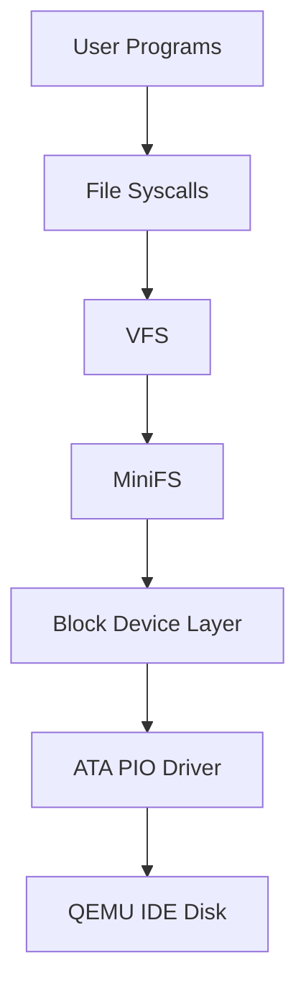

# 磁盘、块设备与 MiniFS 设计

> 覆盖阶段：P6 磁盘与 MiniFS，并影响用户程序和系统调用。

## 磁盘分层



ATA 驱动只处理 512 字节扇区和硬件状态；块设备层把 4 KiB 逻辑块转换为 8 个扇区；MiniFS 不直接访问 ATA 端口。

## 镜像布局

```text
LBA 0
+------------------------------+
| Boot Sector                  |
+------------------------------+
| Stage 2 Loader               |
+------------------------------+
| Kernel ELF                   |
+------------------------------+
| Reserved / Alignment         |
+------------------------------+
| MiniFS Superblock            |
+------------------------------+
| Block Bitmap                 |
+------------------------------+
| Inode Bitmap                 |
+------------------------------+
| Inode Table                  |
+------------------------------+
| Data Blocks                  |
+------------------------------+
```

镜像布局必须由单一配置生成。布局配置应同时服务：

- Stage 1；
- Stage 2；
- mkfs；
- fsck；
- QEMU 测试；
- 文档图表。

## ATA PIO 契约

最低支持主 IDE 主盘 LBA28。必须处理：

- `IDENTIFY`；
- `BSY` 等待；
- `DRQ` 检查；
- `ERR` 和 `DF` 错误；
- 超时；
- 多扇区读写；
- 写后 cache flush；
- 并发访问序列化。

驱动禁止越过设备容量。所有测试写入必须限制在镜像预留测试区或临时镜像，禁止破坏 Boot、Loader、Kernel 和 MiniFS 元数据。

## 块设备层

逻辑块大小：

```text
FS_BLOCK_SIZE = 4096
SECTOR_SIZE = 512
SECTORS_PER_BLOCK = 8
```

接口语义：

- `block_read(block_number, count, buffer)` 读取完整逻辑块；
- `block_write(block_number, count, buffer)` 写入完整逻辑块；
- 块号和 count 必须做溢出与边界检查；
- 所有 MiniFS 元数据读写通过块设备层。

当前 P6 增量已实现主 IDE 主盘的 `IDENTIFY`、LBA28 多扇区读写、状态轮询、超时、写后 cache flush 和关中断串行化，并以 4 KiB 块层统一容量与边界检查。正式启动只读取 Boot Sector 签名和 Kernel ELF 魔数；写路径测试必须使用临时镜像，不能修改权威构建镜像。

## Superblock

字段契约：

```text
magic
version
block_size
total_blocks
total_inodes
block_bitmap_start
block_bitmap_blocks
inode_bitmap_start
inode_bitmap_blocks
inode_table_start
inode_table_blocks
data_start
root_inode
checksum
```

挂载校验：

- magic 匹配；
- version 支持；
- block_size 等于 4096；
- 区域按顺序、不重叠、不越界；
- root_inode 合法；
- checksum 正确；
- bitmap 和 inode table 至少覆盖声明数量。

明显损坏元数据必须拒绝挂载或以只读错误返回，不能越界访问磁盘或内存。

## Inode

字段契约：

```text
mode
link_count
size
direct[10]
indirect
created_tick
modified_tick
```

`mode` 至少区分：

- regular file；
- directory。

块索引：

- 前 10 个文件块使用 direct；
- 后续使用一级 indirect；
- 不实现双重间接；
- 文件最大大小由 direct + indirect 容量决定。

扩容要求：

- 新分配数据块必须清零；
- 中途失败必须回滚本次新分配资源；
- `size` 只有在数据和索引块写入成功后更新。

截断要求：

- 释放超出新大小的块；
- 必要时释放 indirect 块；
- 截断后空间可复用；
- 缩小到 0 后 direct 和 indirect 必须清空。

## 目录项和路径

目录项：

```text
inode: uint32
type: uint8
name[59]
```

目录必须包含 `.` 和 `..`。

路径解析支持：

- `/`；
- 绝对路径；
- 重复 `/`；
- `.`；
- `..`；
- 多级目录；
- 禁止越过根目录；
- 文件名长度上限；
- 路径总长度上限；
- 中间组件不存在或非目录时返回明确错误。

删除规则：

- 不能删除根目录；
- 非空目录不能删除；
- 删除文件必须释放 inode 和数据块；
- 打开的文件删除语义最低可采用“拒绝删除已打开文件”或“延迟释放”，但必须文档化并测试。

## VFS 与 fd

VFS 统一：

- 控制台输出；
- 键盘输入；
- MiniFS 文件；
- MiniFS 目录。

file object 至少包含：

```text
type
inode/reference
offset
flags
refcount
ops
```

要求：

- fd 表属于进程；
- file object 使用引用计数；
- close 和进程退出必须释放引用；
- 多进程独立 offset；
- VFS 不暴露 MiniFS 私有磁盘结构给用户态。

## 宿主工具

P5 为在 MiniFS 实现前验证正式 ELF loader、用户 ABI 与 Shell，允许把同一批用户 ELF 作为只读构建产物链入内核注册表。该过渡来源不占用磁盘文件语义，也不得成为第二套可变文件系统；P6 的 `mkfs.py` 将导入这些 ELF，并由 VFS 取代注册表路径解析。

后续工具：

| 工具 | 职责 |
|---|---|
| `tools/mkfs.py` | 创建 Superblock、bitmap、inode table、根目录、`/bin`，导入用户 ELF |
| `tools/fsck.py` | 只读检查 superblock、bitmap、inode、目录、重复块、孤儿 inode |
| `tools/image.py` | 按统一布局装配 Boot、Loader、Kernel、MiniFS |

所有磁盘结构必须显式 little-endian 编解码，禁止依赖 Python 对象内存布局。
