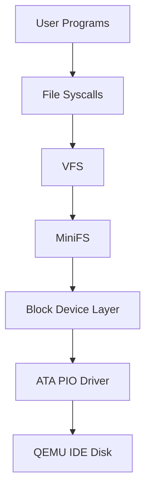

# 磁盘、块设备与 MiniFS 设计

> 覆盖阶段：P6 磁盘与 MiniFS，并影响用户程序和系统调用。

## 磁盘分层



ATA 驱动只处理 512 字节扇区和硬件状态；块设备层把 4 KiB 逻辑块转换为 8 个扇区；MiniFS 不直接访问 ATA 端口。

## 镜像布局

```text
LBA 0
+------------------------------+
| Boot Sector                  |
+------------------------------+
| Stage 2 Loader               |
+------------------------------+
| Kernel ELF                   |
+------------------------------+
| Reserved / Alignment         |
+------------------------------+
| MiniFS Superblock            |
+------------------------------+
| Block Bitmap                 |
+------------------------------+
| Inode Bitmap                 |
+------------------------------+
| Inode Table                  |
+------------------------------+
| Data Blocks                  |
+------------------------------+
```

当前 64 MiB 镜像中，MiniFS 从 LBA 2048（1 MiB、设备逻辑块 256）开始，直到镜像末尾，共 129024 个扇区、16128 个 4 KiB 文件系统块。Superblock 内的所有块号均相对 MiniFS 卷起点，不是磁盘绝对块号。

镜像布局必须由单一配置生成。布局配置应同时服务：

- Stage 1；
- Stage 2；
- mkfs；
- fsck；
- QEMU 测试；
- 文档图表。

## ATA PIO 契约

最低支持主 IDE 主盘 LBA28。必须处理：

- `IDENTIFY`；
- `BSY` 等待；
- `DRQ` 检查；
- `ERR` 和 `DF` 错误；
- 超时；
- 多扇区读写；
- 写后 cache flush；
- 并发访问序列化。

驱动禁止越过设备容量。所有测试写入必须限制在镜像预留测试区或临时镜像，禁止破坏 Boot、Loader、Kernel 和 MiniFS 元数据。

## 块设备层

逻辑块大小：

```text
FS_BLOCK_SIZE = 4096
SECTOR_SIZE = 512
SECTORS_PER_BLOCK = 8
```

接口语义：

- `block_read(block_number, count, buffer)` 读取完整逻辑块；
- `block_write(block_number, count, buffer)` 写入完整逻辑块；
- 块号和 count 必须做溢出与边界检查；
- 所有 MiniFS 元数据读写通过块设备层。

当前 P6 增量已实现主 IDE 主盘的 `IDENTIFY`、LBA28 多扇区读写、状态轮询、超时、写后 cache flush 和关中断串行化，并以 4 KiB 块层统一容量与边界检查。正式启动只读取 Boot Sector 签名和 Kernel ELF 魔数；写路径测试必须使用临时镜像，不能修改权威构建镜像。

## Superblock

Superblock 占文件系统块 0。固定头为 14 个 little-endian `uint32`，其余字节必须为 0：

| 偏移 | 字段 | 初始卷值 |
|---:|---|---:|
| 0 | `magic` | `0x3153464D`（磁盘字节 `MFS1`） |
| 4 | `version` | 1 |
| 8 | `block_size` | 4096 |
| 12 | `total_blocks` | 16128 |
| 16 | `total_inodes` | 1024 |
| 20 | `block_bitmap_start` | 1 |
| 24 | `block_bitmap_blocks` | 按卷大小计算 |
| 28 | `inode_bitmap_start` | 紧随 block bitmap |
| 32 | `inode_bitmap_blocks` | 按 inode 数计算 |
| 36 | `inode_table_start` | 紧随 inode bitmap |
| 40 | `inode_table_blocks` | 按 64 字节 inode 计算 |
| 44 | `data_start` | 紧随 inode table |
| 48 | `root_inode` | 0 |
| 52 | `checksum` | CRC32 |

`checksum` 使用 IEEE CRC32，计算范围为完整 4096 字节 Superblock；计算时偏移 52 的字段视为 0。bitmap 的 bit 采用 LSB-first 编号，超出声明容量的尾部 bit 置 1，防止分配器误用。

挂载校验：

- magic 匹配；
- version 支持；
- block_size 等于 4096；
- 区域按顺序、不重叠、不越界；
- root_inode 合法；
- checksum 正确；
- bitmap 和 inode table 至少覆盖声明数量。

明显损坏元数据必须拒绝挂载或以只读错误返回，不能越界访问磁盘或内存。

当前内核挂载位置由 `config/image-layout.json` 生成 C 头，不在内核中重复硬编码。挂载会核对设备容量、完整 Superblock CRC32、元数据几何、元数据 block bitmap、root inode bitmap 和 root 目录；所有 inode、direct/indirect 指针、目录项和文件内容均显式 little-endian 解码。路径解析已支持 `/`、重复 `/`、`.`、`..`、尾随 `/` 和多级目录，并在真实 QEMU 中把磁盘 `/bin` 的 6 个 ELF 与 P5 过渡注册表逐字节比对。

当前可写内核接口为 `minifs_create`、`minifs_write`、`minifs_truncate`、`minifs_mkdir` 和 `minifs_unlink`。bitmap 分配器跳过保留区与 inode 0；新数据块先清零，数据与 indirect 索引成功落盘后才提交 inode `size`。写入不允许产生稀疏文件，截断当前只支持缩小；截断会释放多余 direct/indirect 数据块，并在不再需要时释放 indirect 索引块。单次 I/O 失败会尽力回滚本次新分配 bit、指针或目录项；最低版本没有日志，宿主断电级原子性不在当前保证范围内。

目录创建会分配并初始化 `.`、`..`，同时维护子目录和父目录的 `link_count`。目录项删除后整项清零为 `type=0`，后续创建优先复用空洞；没有空洞且尾部位于块边界时按普通 inode direct/indirect 规则分配清零的新目录块。`unlink` 拒绝根目录、非空目录和 VFS 中仍打开的 inode，成功后释放目标 inode 及其全部数据/索引块。`minifs_readdir` 跳过空洞并返回稳定的下一偏移。`KERNEL_TEST_MINIFS_WRITE=1` 临时镜像除跨 direct/indirect 文件持久化外，还在第一次启动创建含 65 个普通文件的双块目录，第二次启动迭代、删除并由宿主 fsck 复核；默认产品构建不执行该压力自测。

## Inode

每个 inode 固定 64 字节：

| 偏移 | 字段 | 类型 |
|---:|---|---|
| 0 | `mode` | `uint16` |
| 2 | `link_count` | `uint16` |
| 4 | `size` | `uint32` |
| 8 | `direct[10]` | `uint32[10]` |
| 48 | `indirect` | `uint32` |
| 52 | `created_tick` | `uint32` |
| 56 | `modified_tick` | `uint32` |
| 60 | `reserved` | `uint32`，必须为 0 |

`mode` 至少区分：

- `1`：regular file；
- `2`：directory。

块索引：

- 前 10 个文件块使用 direct；
- 后续使用一级 indirect；
- 不实现双重间接；
- 文件最大大小由 direct + indirect 容量决定。

扩容要求：

- 新分配数据块必须清零；
- 中途失败必须回滚本次新分配资源；
- `size` 只有在数据和索引块写入成功后更新。

截断要求：

- 释放超出新大小的块；
- 必要时释放 indirect 块；
- 截断后空间可复用；
- 缩小到 0 后 direct 和 indirect 必须清空。

## 目录项和路径

目录项：

```text
inode: uint32
type: uint8
name[59]
```

目录项固定 64 字节并显式 little-endian；`type` 使用 `0` 表示未使用、`1` 表示普通文件、`2` 表示目录。有效名称最长 58 bytes，必须以 NUL 结束且不得包含 `/`；名称按原始 UTF-8 bytes 比较，最低版本的宿主工具只导入 ASCII 名称。

目录必须包含 `.` 和 `..`。

路径解析支持：

- `/`；
- 绝对路径；
- 重复 `/`；
- `.`；
- `..`；
- 多级目录；
- 禁止越过根目录；
- 文件名长度上限；
- 路径总长度上限；
- 中间组件不存在或非目录时返回明确错误。

删除规则：

- 不能删除根目录；
- 非空目录不能删除；
- 删除文件必须释放 inode 和数据块；
- 打开的文件删除语义最低可采用“拒绝删除已打开文件”或“延迟释放”，但必须文档化并测试。

## VFS 与 fd

VFS 统一：

- 控制台输出；
- 键盘输入；
- MiniFS 文件；
- MiniFS 目录。

file object 至少包含：

```text
type
inode/reference
offset
flags
refcount
ops
```

要求：

- fd 表属于进程；
- file object 使用引用计数；
- close 和进程退出必须释放引用；
- 多进程独立 offset；
- VFS 不暴露 MiniFS 私有磁盘结构给用户态。

当前内核已建立 32 项全局 file object 池和每进程 16 项 fd 表；fd 0/1/2 仍由 syscall 控制台适配层保留，普通文件和目录从 fd 3 开始。file object 保存后端类型、MiniFS inode、独立 offset、flags、refcount 与 ops；同一 inode 的两次 `open` 使用两个对象，因此 offset 互不影响。`open/read/write/lseek/close/stat/mkdir/unlink/readdir` 已接入 MiniFS，支持 `O_RDONLY/O_WRONLY/O_RDWR/O_CREAT/O_TRUNC`，拒绝未知 flags、目录写入、无权限访问和删除仍打开的 inode。共享 `struct minios_dirent` 只包含 inode、mode、名称长度和 NUL 结尾名称，不暴露磁盘目录项；每次成功 `readdir` 推进该 file object 的独立 offset，空洞对用户态不可见。进程 `exit` 或用户 fault 会关闭其全部普通 fd；用户态自测故意遗留一个打开文件，并在进程回收后由 VFS 池完整性自测确认引用已释放。控制台/键盘对象化和普通 fd 继承仍待后续增量。

## 宿主工具

P5 为在 MiniFS 实现前验证正式 ELF loader、用户 ABI 与 Shell，允许把同一批用户 ELF 作为只读构建产物链入内核注册表。P6 当前已由 VFS 读取 `/bin/init` 及其全部子程序 ELF；注册表只保留为过渡期逐字节磁盘一致性自测来源，不再参与 `spawn(path, argv)` 的运行时路径解析，也不得成为第二套可变文件系统。

后续工具：

| 工具 | 职责 |
|---|---|
| `tools/mkfs.py` | 创建 Superblock、bitmap、inode table、根目录、`/bin`，导入用户 ELF |
| `tools/fsck.py` | 只读检查 superblock、bitmap、inode、目录、重复块、孤儿 inode |
| `tools/make_image.py` | 按统一布局装配 Boot、Loader、Kernel、MiniFS |

所有磁盘结构必须显式 little-endian 编解码，禁止依赖 Python 对象内存布局。
