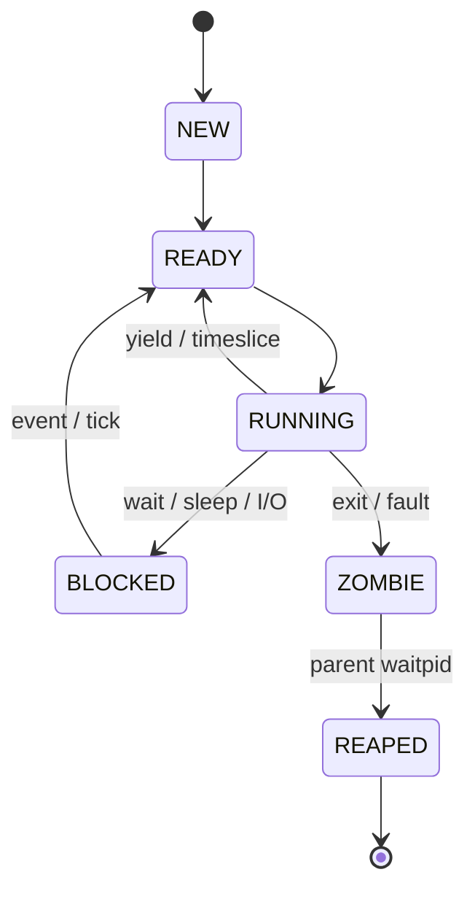

# 进程、调度与用户态设计

> 覆盖阶段：P4 进程与系统调用、P5 用户态，并依赖 `memory.md` 和 `syscall.md`。

## 进程模型

最低支持：

- 内核线程；
- Ring 3 用户进程；
- 抢占式时间片轮转；
- `yield`；
- `sleep`；
- `exit`；
- `waitpid`；
- 父子关系；
- 僵尸回收；
- 用户进程异常退出。

最低不实现 `fork`。进程创建使用 `spawn(path, argv)`，避免引入写时复制或完整地址空间复制。

## PCB 契约

PCB 至少包含：

```text
pid
state
name[32]
cpu_context
kernel_stack_top
user_stack_top
page_directory
exit_code
parent_pid
wake_tick
time_slice
fd_table[MAX_FDS]
run_node
wait_node
```

实现要求：

- PID 单调分配，耗尽后可扫描复用已回收 PID；
- `name` 必须 NUL 结尾；
- 每个进程拥有独立内核栈；
- 用户进程拥有独立页目录；
- `fd_table` 由 VFS 引用计数管理；
- PCB 状态转换必须在关中断或调度锁保护下完成。

## 状态机



禁止状态：

- `RUNNING` 进程同时在 run queue 中；
- `REAPED` 进程仍持有用户页；
- `ZOMBIE` 进程仍占用文件描述符引用；
- `BLOCKED` 进程没有唤醒条件。

## 上下文切换

内核线程切换保存通用寄存器、栈指针和返回地址。用户进程从中断或系统调用返回时，依赖中断帧恢复用户态寄存器。

当前 P4 协作式内核线程实现使用 16 项静态 PCB 表，slot 0 接管启动线程，其他线程从 Heap 获得 16 KiB 独立内核栈。汇编 `context_switch` 保存 EBP/EBX/ESI/EDI 与 ESP；首次栈返回到 C trampoline，既有线程则返回原 `scheduler_yield` 调用点。状态选择与切换在保存 EFLAGS 后关中断执行，每次切换同步 TSS `esp0`。三线程自检严格验证 `1,2,3,1,2,3` round-robin 轨迹、ZOMBIE 退出和所有栈块回收。

该增量尚未声称抢占式完成：当前 PIT 只计数，时间片耗尽接入 IRQ 尾部属于下一步。PID 当前单调分配；达到 `UINT32_MAX` 后的已回收 PID 扫描复用也需在 P4 完成前补齐。

切换进程时必须：

1. 选择下一个 READY 进程。
2. 保存当前上下文。
3. 如目标页目录不同，切换 CR3。
4. 更新 TSS `esp0` 为目标进程内核栈顶。
5. 切换内核栈。
6. 恢复目标上下文或中断帧。

## 抢占式调度

PIT 产生时钟 tick。每个 tick：

- 全局 tick 递增；
- 唤醒 `wake_tick <= current_tick` 的睡眠进程；
- 当前进程时间片递减；
- 时间片耗尽时标记需要调度；
- 中断返回前执行调度。

中断处理必须避免在不可重入区域直接切换。最低方案可使用 `need_resched` 标志，在中断尾部统一调度。

## Ring 3 进入路径

首次进入用户程序通过构造中断返回帧并执行 `iret`：

```text
SS=user_data_selector
ESP=user_stack_top
EFLAGS=IF=1
CS=user_code_selector
EIP=elf_entry
```

GDT 必须包含 Ring 3 code/data 描述符。TSS 必须提供 Ring 3 -> Ring 0 时使用的 `ss0` 和 `esp0`。

## ELF 用户程序加载

只支持静态 ELF32 `ET_EXEC`。加载器必须：

- 验证 ELF Header；
- 验证 Program Header 范围；
- 拒绝段覆盖内核空间；
- 拒绝 `filesz > memsz`；
- 为 `PT_LOAD` 段分配用户页；
- 复制文件内容并清零 BSS；
- 根据段权限设置页表位；
- 分配用户栈和保护页；
- 构造 `argc/argv`；
- 创建初始中断帧。

用户程序从 `/bin/init` 开始，`init` 拉起 `/bin/sh`。Shell 负责前台命令 spawn 和 waitpid。

## 用户程序最低集合

| 程序 | 功能 |
|---|---|
| `/bin/init` | 启动 Shell，必要时重启 Shell |
| `/bin/sh` | 命令输入、分词、内建命令、执行外部程序 |
| `/bin/echo` | 输出参数 |
| `/bin/ls` | 列目录 |
| `/bin/cat` | 输出文件 |
| `/bin/touch` | 创建空文件 |
| `/bin/write` | 写入或覆盖文件 |
| `/bin/mkdir` | 创建目录 |
| `/bin/rm` | 删除文件 |
| `/bin/ps` | 显示进程 |
| `/bin/memtest` | 验证地址空间隔离 |
| `/bin/fault` | 触发非法访问，验证异常隔离 |

Shell 最低内建：`help`、`clear`、`cd`、`pwd`。
